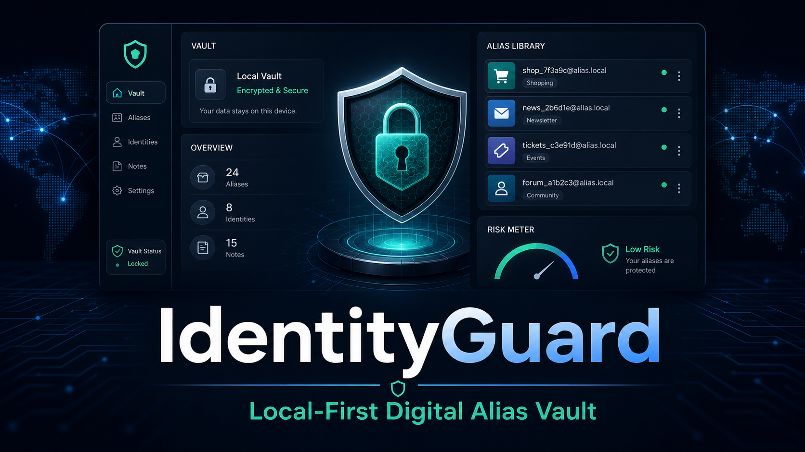

# IdentityGuard



IdentityGuard is a local-first digital alias vault for privacy-preserving identity workflows. It helps users create one-use aliases for banks, exchanges, vendors, marketplaces, onboarding forms, and other contexts where reusing the same identity reference increases exposure.

The default open-source build runs in the browser, encrypts the vault locally, and does not require a cloud API key. The current app also includes SaaS-ready account, billing-plan, sync-readiness, and audit screens so teams can test the commercial workflow before connecting production infrastructure.

## Why It Exists

People reuse the same identity details across too many services. When one service leaks, it becomes easier to link the same person across other platforms. IdentityGuard gives users a practical workflow:

- create a unique alias per service context
- keep alias history in an encrypted local vault
- copy, revoke, and export aliases
- review local risk notes before using an alias
- avoid exposing AI/API secrets in browser code

## Features

- Local-first React/Vite app
- Encrypted browser vault using AES-GCM
- PBKDF2-derived vault key from the user's passphrase
- Strong browser crypto through Web Crypto APIs
- Base58-encoded digital aliases
- Local deterministic risk analysis
- Optional private AI endpoint support through `VITE_IDENTITYGUARD_AI_ENDPOINT`
- Copy, revoke, export, and clear vault controls
- SaaS test account flow for email-based onboarding
- Free, Pro, and Team plan selection model
- Encrypted sync readiness screen for private backend planning
- Local audit trail for account and vault workflow events
- Defensive-only open-source security posture

## Security Model

IdentityGuard default mode keeps identity processing in the browser. It does not send name, date of birth, address, or context to a server.

The vault is encrypted before being stored in browser local storage. This improves privacy but does not make a compromised device safe. Malware, malicious browser extensions, device theft, and weak passphrases can still put data at risk.

Generated aliases are privacy workflow identifiers. They are not official IDs, legal credentials, or authentication tokens.

## SaaS Edition Path

IdentityGuard can be upgraded into a hosted commercial SaaS by adding production backend services for authentication, encrypted sync, billing, email delivery, audit storage, and support operations.

The repo includes planning documents for that path:

- [SaaS implementation plan](./docs/SAAS_IMPLEMENTATION.md)
- [SaaS API contract](./docs/API_CONTRACT.md)
- [Release audit](./docs/RELEASE_AUDIT.md)

The browser app deliberately does not store payment secrets, AI provider keys, or raw backend credentials.

## Quick Start

Requirements:

- Node.js 20 or newer
- npm

```bash
npm install
npm run dev
```

Then open the local Vite URL shown in your terminal.

## Production Build

```bash
npm run typecheck
npm run build
npm run preview
```

## Optional AI Endpoint

The open-source app does not expose Gemini, OpenAI, or other model-provider keys in the browser.

If you want AI-assisted risk analysis, create your own private backend endpoint and set:

```bash
VITE_IDENTITYGUARD_AI_ENDPOINT=https://your-private-endpoint.example.com/analyze
```

The endpoint should accept:

```json
{
  "context": "Business banking"
}
```

And return:

```json
{
  "summary": "High caution recommended for this identity workflow.",
  "score": 72,
  "findings": [],
  "recommendations": []
}
```

If no endpoint is configured, IdentityGuard uses local deterministic analysis.

## Project Structure

```text
.
├── App.tsx
├── constants.tsx
├── index.html
├── index.tsx
├── services
│   ├── cryptoService.ts
│   ├── accountService.ts
│   ├── geminiService.ts
│   ├── riskService.ts
│   ├── syncService.ts
│   └── vaultService.ts
├── styles.css
├── types.ts
├── docs
│   ├── API_CONTRACT.md
│   ├── RELEASE_AUDIT.md
│   ├── SAAS_IMPLEMENTATION.md
│   └── product-images
└── vite.config.ts
```

## Roadmap

- Add automated browser smoke tests
- Add import flow for exported vault files
- Add passphrase strength meter
- Add optional WebAuthn unlock support
- Add signed release artifacts
- Build the production backend for auth, billing, sync, and AI risk analysis

## Defensive Use Only

IdentityGuard is intended for privacy hygiene, identity compartmentalization, and defensive security education. Do not use it for fraud, impersonation, unauthorized access, credential theft, evasion, or deception.

## License

MIT
